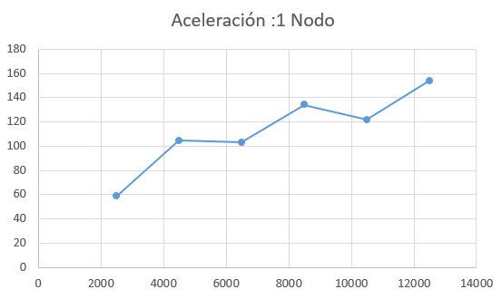

# PARCIAL 2 - HIGH PERFORMANCE COMPUTING

Se realizó la implementación en ```CUDA``` y ```MPI``` de la multiplicacion de matrices
aprovechando el manejo sobre CPU y GPU que nos brindan estas dos herramientas
para posteriormente realizar un comparativo sobre los tiempos que nos arrojaban.

para la realizacion de este trabajo se debio investigar sobre como compilar ```CUDA``` y ```MPI``` juntos, lo cual encontramos que se podia realizar mediante los siguientes pasos:

1. Se deben crear dos archivos de codigo fuente diferentes, uno con extension ```.c``` donde se encuentre toda la implementacion sobre ```MPI``` y un llamado a una funcion de tipo void que sera definida en el archivo con extension ```.cu``` donde se encuentra el codigo de ```CUDA``` pero en este solo debe de estar el kernel y el codigo que va en el main en una funcion de tipo void de esta manera:

  el kernel

  ```

  __global__ void kernelMultMat(double *d_a, double *d_b, double *d_c, int ROWS, int COL_A, int COL_B) {
    ...
    |
    ...
  }

  ```
    y la funcion de tipo void
  ```
    void cuda_mult_matriz(double *h_a,double *h_b, double *h_c,int ROWS, int COL_A, int COL_B){
      ...
      |
      ...
    }

    ```

    para el llamado en el archivo .c primero se le dice al compilador que se va usar esta funcion con la siguiente linea

    ```
      void cuda_mult_matriz(double *h_a,double *h_b, double *h_c,int ROWS, int COL_A, int COL_B);
    ```

    y despues se hace el llamado de la siguiente manera en cada worker o donde sea necesaria usarla
    ```
    cuda_mult_matriz(matBuffA,matBuffB,matBuffC,nRows,COLA,COLB);
    ```

2. Se debe definir un archivo .sh para el proceso de compilacion, el cual debe contener las siquientes lineas:

    ```
    mpic++ -c mpi_mult_matriz.c -o mpi_mult_matriz.o

    /usr/local/cuda/bin/nvcc -c cuda_mult_matriz.cu -o cuda_mult_matriz.o -Wno-deprecated-gpu-targets

    mpic++ mpi_mult_matriz.o cuda_mult_matriz.o -o mpiWithCuda_mm -L/usr/local/cuda/lib64/ -lcudart
    ```

    la primer linea se usa para compilar el archivo ```.c ``` donde con el parametro -c se le indica al compilador que no linkee todavia las funciones lo cual permite que el llamado que se hace en el archivo ```.c ```no genere ningun error por no estar definida dentro de este, esto mismo pasa con la siguiente linea donde lo que se cambia es el compilador por el de ```CUDA```.

    Las dos primeras lineas generan un archivo ```.o```  "Codigo Objeto", que es un conjunto de instrucciones y datos escritos en un lenguaje que entiende el ordenador directamente: binario o código máquina. Provienen de la traducción de cierto código fuente y es un fragmento del programa final específico de la plataforma de ejecución.

    En la tercera linea se usa alguno de los dos compiladores para generar el archivo con el codigo ejecutable.

3. Se define otro archivo .sh para los procesos de ejecucion el cual contiene las siguientes lineas para su funcionamiento

  ```
  #!/bin/bash

  #SBATCH --job-name=mpiWithCuda_mm
  #SBATCH --output=mpiWithCuda.out
  #SBATCH --nodes=4
  #SBATCH --ntasks-per-node=8
  #SBATCH --gres=gpu:1

  export CUDA_VISIBLE_DEVICES=0
  mpirun mpiWithCuda_mm
  ```
4. se ejecuta el siguiente comando para compilar lo especificado en el archivo compile.sh

  ```
  sh compile.sh
  ```
5. ahora con la siguiente linea le decimos al scheduler que distribuya el trabajo segun las configuraciones descritas en el archivo de ejecucion que en nuestro caso se llamo mpi_mm.sh

  ```
  sbatch mpi_mm.sh
  ```
6. Para visualizar el resultado ejecutamos una de las siguientes lineas

  ```
  cat *.out
  ```
  ```
  cat mpiWithCuda.out
  ```

## ANALISIS DE DATOS

### Tiempo de ejecucion utilizando un Nodo.

|Tamaño de matrices|   GPU   |    CPU    |Aceleración|
|------------------|---------|-----------|-----------|
|12500             |35,641411|5481,517614|153,7963133|
|10500             |21,434562|2609,043757|121,7213469|
|8500              |11,573089|1552,982527|134,1891112|
|6500              | 5,23061 |538,473535 |102,9466037|
|4500              |1,835243 |191,818566 |104,5194375|
|2500              |0,412166 | 24,211979 |58,74327092|
#### Grafica de tiempos

#### Grafica del factor de aceleracion


### Tiempo de ejecucion utilizando dos Nodo.

|Tamaño de matrices|   GPU   |    CPU    |Aceleración|
|------------------|---------|-----------|-----------|
|13000             |74,650037|3958,268985|53,02434056|
|11000             |49,62557 |1499,954044|30,22542701|
|9000              |30,603564|686,930073 |22,44608089|
|7000              |16,621691|293,377225 |17,65026344|
|5000              |7,621721 |98,685564  |12,94793709|
|3000              |2,480732 |21,726039  |8,757914599|

#### Grafica de tiempos

#### Grafica del factor de aceleracion


### Tiempo de ejecucion utilizando tres Nodos.

|Tamaño de matrices|   GPU   |    CPU    |Aceleración|
|------------------|---------|-----------|-----------|
|14000             |73,143201|2934,73892 |54,11670437|
|12000             |51,589732|1324,245601|29,07466245|
|10000             |33,736139|743,626325 |20,36184618|
|8000              |20,638844|669,679305 |14,21480898|
|6000              |10,874133|140,301508 |9,075258138|
|4000              |4,617811 |67,595382  |4,70483504|

#### Grafica de tiempos

#### Grafica del factor de aceleracion


# CONCLUSIONES

* La ejecucion realizada en gpu por medio de cuda es mucho mas rapida que la que realizamos en mpi, debido a la capacidad de paralelizacion que nos brinda una gpu en comparacion con la de una cpu que tiene mas memoria pero una alu mas pequeña, lo cual es inverso en una gpu.
* Para ambas implementaciones se hicieron pruebas en 1 , 2 y 3 nodos donde se pudo observar que al aumentar el numero de nodos, lo cual simbolizaba un aumento en la cantidad de recursos mejoraba el desempeño de ambos
* al aumentar la cantidad de nodos se disminuyeron tiempos y se pudo aumentar la dimension de las matrices

***
###### Farley Estiven Gonzalez Osorio
###### Robert Sneyder Garcia Moreno
